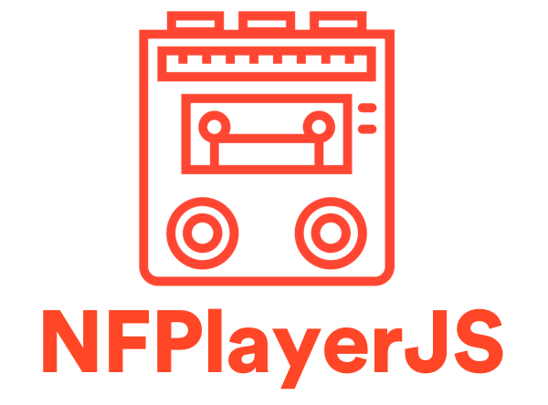

<p style="text-align: center;" align="center">
  
</p>

[](LICENSE)
[](https://slackin.spotify.com)
[](http://clayallsopp.github.io/readme-score?url=https://github.com/spotify/NFPlayerJS)

A JavaScript/TypeScript audio engine capable of multitrack time stretching, pitch shifting, declarative effects, faster than realtime processing, and more!

# Getting Started (Browser) 🚀

1. Install the player: `npm install --save nf-player`
2. Describe your audio experience using [NFGrapher][nfgrapher] `npm install --save nf-grapher`, or use a prebuilt [JSON Score](./fixtures).
3. Listen to it!

```js
// In a browser, probably webpack-powered...
import { SmartPlayer, TimeInstant } from 'nf-player';
import * as ScoreJSON from './your-score.json';

(async function() {
  // Create player. By default it uses Web Audio to insert audio data into
  // the current audio device.
  const p = new SmartPlayer();

  // Load the score and referenced audio files.
  await p.enqueueScore(ScoreJSON);

  // Play! `renderTime` will now proceed to increase.
  p.playing = true;

  // You can instantly seek if you want.
  p.renderTime = TimeInstant.fromSeconds(30);
})();
```

For more demos, check out the [Playground][playground], which contains a live-coding environment, sample code, and sample JSON Scores, all in your browser!

There are also in-progress [API Docs][api docs].

# Getting Started (CLI) 🚀🚀

A [CLI](./src/cli.ts) also ships with this package!

```sh
$ npx nf-player save --duration 120 --input-file ./fixtures/roxanne-30s-preview-shifted-infinite.json --output-file ./roxanne.wav
```

The above command will load the Score JSON, download the audio files, and render 120 seconds of audio to a file called `tng.wav`. This should happen in about 5 seconds of realtime, depending on your computer and internet connection.

# Raison D'être :thought_balloon:

Given a way to [describe arbitrary audio experiences over time][nfgrapher], we needed a player to play them. This repo serves as a reference implementation of the patterns required to process a Grapher Score, as well as a testbed for new features and API design.

Due to the nature of Grapher Scores, this player is capable of playback experiences that are generally outside the realm of a standard "track based" audio player, such as Winamp, Spotify, or VLC, and closer to an audio game engine. These include:

- infinite playback (never ending loops, infinite-jukebox-style)
- evolving or generative playback (subtle changes over time, procedurally generated changes)
- adaptive playback (user input, such as location)

By providing a unifying, declarative format to describe these experiences (and with a matching player implementation), they can be shared by multiple platforms, such as multiple apps on your phone, websites, or physical devices. This is notably different from device or platform specific APIs like the Web Audio API, Core Audio, or Windows Audio Graphs, which often require imperative coding using programming languages specific to each. Composable time stretching, for example, is not possible without abandoning most (if not all) of the ergonomics of the Web Audio API.

# Architecture :triangular_ruler:

A Grapher Score describes, basically, an audio processing graph, where each node of the graph is either a producer of audio, a consumer, or both, in the case of transformation. The edges of the graph control where the audio "flows". This is basically the same as the [Web Audio API](https://developer.mozilla.org/en-US/docs/Web/API/Web_Audio_API), except instead of an imperative creation of the graph by the programmer, building it up piece by piece, a Grapher Score is a complete declarative description of the graph, including all the nodes, edges, and changes in values over time (Audio Parameter Commands). It can be de/serialized from/to JSON, and can be thought of as a JSON description of what to load, play, and change over time. It is given to the Player whole, and processed as a whole. Changes are described as _Mutations_ to the Score, which are currently limted to adding and removing scheduled audio parameter changes. Multiple scores can be loaded, processed, and played by the Player, which allows for seamless switching between scores, and therefore seamless audio playback.

Once given to the Player, a Grapher Score is traversed, recursively, each render quantum (default is 8192 samples, ~0.185 seconds). Each node/plugin requests samples for the current quantum from its ancestors in the graph, passing its own notion of the current render time, which could be dilated due to time stretching or shifted due to looping. Each node/plugin applies whatever processing it wants by reading the config and audio params of the node for the current time, then forwards the resulting samples. All the buffers are then mixed down and written using the Web Audio API (or in the case of a CLI, a chunk of a WAV file).

Passing and modifying the current notion of time, recursively through ancestors, is what sets this player apart from other players built on top of APIs like Web Audio: a Stretch node, for example, can affect time for an entire subgraph, requiring that subgraph to be rendered much faster than realtime. This is extremely powerful (an entire graph could be audibly "sped up" like fast forwarding a tape cassette) but requires this processing model.

It should also be noted that all "leaves" of the Grapher Score are implicitly connected to the [(internal) output node](/src/nodes/SPDestinationNode.ts). Therefore, many Scores look like discontiguous graphs.

# Basic Capabilities 🎧

- Supported [Grapher Score Nodes](https://github.com/spotify/NFGrapher/blob/master/doc/smartplayer.md):
  - Stretch (pitchshifting and timestretching, provided by a TS port of [SoundTouch](https://github.com/kirbysayshi/soundtouch-ts))
  - Loop
  - Gain (volume)
  - File ([`fetch`](https://developer.mozilla.org/en-US/docs/Web/API/Fetch_API)-able urls only)
- Seeking
- Processing audio faster than realtime with [reasonable](#fn-reasonable) performance
- Realtime mutations of the current Score
- Loading / Processing / Playing multiple Scores

# Limitations 🤖

- Loads all audio files into memory all at once using [`fetch`](https://developer.mozilla.org/en-US/docs/Web/API/Fetch_API) / [decodeAudioData][]
- Only supports whatever audio formats the platform supports (due to using [decodeAudioData][])
- No DRM / EME support (the EME API does not provide faster-than-realtime access to the audio samples)
- Does all processing on the main thread (but with fairly low CPU usage). This could be mitigated by running the entire player in a Web Worker or, eventually, Audio Worklet.

[decodeaudiodata]: https://developer.mozilla.org/en-US/docs/Web/API/BaseAudioContext/decodeAudioData

# Capabilities by Example 🏃‍♀️🏃‍♂️

See the [Playground][playground]!

# Development 🏗

Clone this repo, then:

```sh
$ npm install
```

To build the library and start the development environment:

```sh
$ npm start
```

To build and publish the demo to [gh-pages](playground), run:

```sh
$ npm run deploy
```

There is also a more cut-down [debug environment](./debug-harness/index.ts) useful for debugging / developing single Scores or scripts:

```sh
$ npm run debug-harness
```

# Deployment / Publishing / Release 🚢

### Publishing:

- Ideally: `npm version [major|minor|patch]`, then PR.
- Merge a package.json version change that is currently unpublished.

### Demo Deployment:

- `npm run deploy`

# Contributing 💖⌨️

This project adheres to the [Open Code of Conduct](https://github.com/spotify/code-of-conduct/blob/master/code-of-conduct.md). By participating, you are expected to honor this code.

# License 👩‍⚖️

[Apache 2.0](./LICENSE)

## Acknowledgements

NFPlayerJS depends on [SoundTouch-TS](https://github.com/kirbysayshi/soundtouch-ts) which is licensed under the [GNU Lesser General Public Library, version 2.1](https://www.gnu.org/licenses/lgpl-2.1.en.html).

To comply with section 6 of the LGPL, SoundTouch can be swapped out at runtime by any user by placing an API-compatible replacement at `window.SoundTouch` or `global.SoundTouch`.

[music player by SBTS from the Noun Project](https://thenounproject.com/search/?q=cassete&i=1394525).

# Notes 📝

<b id="fn-reasonable"></b> "Reasonable" is ambiguous, of course. In this case, it means "expected CPU usage if audio is the primary purpose of the experience". For example, an authoring tool or enhanced listening experience. It's still unclear to if CPU usage is low enough for a background task like listening to a playlist.

[nfgrapher]: https://github.com/spotify/NFGrapher
[playground]: https://spotify.github.io/NFPlayerJS/
[api docs]: https://spotify.github.io/NFPlayerJS/docs/
